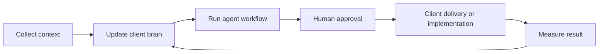

# Growth Brain Operating Kit

This is the entire TinyStudio agency plan in one place.

## Simple Version

We help a business make better marketing decisions by building a "brain" from what they already know: website, products, reviews, ads, emails, competitors, analytics, and founder notes.

Then we run small agent workflows against that brain:

1. Find the leak.
2. Draft the fix.
3. Human-review it.
4. Ship or hand it to the client.
5. Measure what happened.
6. Save the learning back into the brain.

## Offer To Sell First

Sell the Tangible Revenue Leak Sprint + Search Trust Layer.

- Founder price for first 3 clients: `$1,000`.
- Standard sprint price: `$2,500-$5,000`.
- Weekly Growth Desk after the sprint: `$2,000-$5,000/month` for weekly experiments, reporting, and asset creation.
- Full-Stack Growth Desk after channel readiness: `$5,000-$12,000/month` for SEO, paid, lifecycle/email, content, reputation, analytics, CRO, creative, and automation loops.
- Operator-Led Growth Pod after paid-client proof: `$12,000+/month`.

The sprint is built to get paid now. It does not require SaaS, paid ads, a full website rebuild, buying backlinks, or hiring. TinyStudio Growth Brain is the internal system that powers the sprint.

The expansion path is researched and documented in:

```bash
growth-brain/strategy/full-stack-growth-offer-ladder.md
growth-brain/quality/channel-readiness-scorecard.md
growth-brain/workflows/full-stack-growth-desk-workflow.md
growth-brain/workflows/repeatable-workflow-operating-system.md
```

Generate the current service map with:

```bash
npm run growth:service-map
```

Every client folder gets its own channel readiness scorecard:

```bash
npm run client:channels -- clients/client-slug
npm run client:channels-check -- clients/client-slug
```

The weekly client loop refreshes this automatically before the dashboard, renewal review, and readiness checks.

Delivery order:

1. Conversion fixes first: make the page clear enough that buyers understand the offer and take action.
2. On-site search trust second: title/meta, headings, internal links, service-page structure, FAQs, schema where useful, sitemap/canonical/crawl basics, and local/service-area relevance.
3. Off-site only as trust/distribution: real citations, Google Business Profile, partner/vendor listings, reviews/testimonials, proof assets, useful citeable pages, and real PR/community mentions.

The detailed checklist lives in:

```bash
growth-brain/quality/search-trust-layer.md
```

## Scale Path

Do not try to offer everything on day one.

1. Find the real bottleneck.
2. Study the gap versus current tools, agencies, competitors, and the client's own data.
3. Extract the principle behind the fix.
4. Design the simplest flow.
5. Build the smallest useful system.
6. Test it against real output.
7. Feed results back into the client brain.
8. Add one adjacent service line only after the loop is repeatable.
9. Become the client's outsourced growth desk, not a replaceable one-task vendor.

## Best First Clients

Prioritize businesses that already have proof:

- Shopify or ecommerce brands with real orders.
- Local service businesses with reviews and traffic.
- B2B service companies with confusing service pages and valuable search intent.
- Founder-led SaaS or info products with existing landing pages and emails.
- Teams that have tried ads, email, SEO, social, or launches but are not learning from the data.

Avoid pre-revenue ideas, vague "personal brands", and clients who want magic without giving context.

## Operating Loop



## First Seven Agents

- Product Page Fixer
- Landing Page Fixer
- Site Architecture Fixer
- Ad Angle Generator
- Email/SMS Generator
- Competitor Watcher
- Weekly Performance Analyst

An agent is not fancy software yet. It is a repeatable workflow with required inputs, a checklist, an output format, an approval gate, and a measurement rule.

## Daily Execution Rule

Every workday should produce one of these:

- a prospect list
- a Loom audit
- a sales call
- a paid sprint
- a client deliverable
- a measured learning added back into a client brain

Start the day with:

```bash
npm run growth:start
```

That command refreshes the daily money mission and opens the current bottleneck view automatically.

For a plain-text snapshot, run:

```bash
npm run growth:today
```

That command reads `TASKS.md`, current prospect folders, and current client folders, then returns the next actions to move money or delivery forward.

For the health check plus the next best command, run:

```bash
npm run growth:doctor
```

That command writes `growth-brain/ops/growth-doctor.md`, checks safety gates, and names the current money bottleneck.

Use the browser cockpit when working through the day:

```bash
npm run growth:start -- --view=record
```

Use `--view=mission`, `--view=score`, `--view=send`, `--view=followup`, or `--view=sales` when you want to force a specific view.

Use live metrics when deciding what to improve:

```bash
npm run growth:metrics
```

That command writes `growth-brain/ops/live-metrics.md`.

Use the proof library before making claims or case-study copy:

```bash
npm run growth:proof
```

That command writes `growth-brain/ops/proof-library.md`.

Use the market parity gate before calling the workflow 11/10, comparable, or better:

```bash
npm run market:parity
```

That command writes `growth-brain/ops/market-parity-readiness.md` and refuses to treat internal automation as proof of market demand, delivery outcomes, or retention.

When the parity gate fails, create the next proof run:

```bash
npm run market:proof-run
```

That command writes `growth-brain/ops/11-10-proof-run.md` and refreshes `prospects/loom-links.txt` with the exact Loom batch, proof-capture rows, send route, and sales/delivery/retention evidence needed next.

After recording the batch, paste either five Loom URLs in order or rows like `prospects/prospect-slug|https://www.loom.com/share/...`, then run the post-recording prep:

```bash
npm run market:after-recording -- --from-clipboard
```

That command preserves the approved leak, impact, fix, and ask notes already in `prospects/loom-links.txt`, prepares the send packages when the five rows are ready, refreshes `prospects/outbox.html`, and refreshes the proof cockpit. It does not mark sends, create fake proof, or move pipeline stages.

Use the lower-level updater only when you want to update Loom URLs without preparing send packages:

```bash
npm run market:recordings -- --from-clipboard
```

After recording or sending, check the proof session:

```bash
npm run market:proof-check
```

That command writes `growth-brain/ops/market-proof-run-check.md` and tells us whether the 5-Loom session still needs recording, is ready for send prep, is ready for outbox sending, or has sent proof captured.

Use the proof cockpit when Nish needs the proof run in one visual owner surface:

```bash
npm run market:proof-cockpit
```

That command writes `growth-brain/ops/market-proof-cockpit.md` and `growth-brain/ops/market-proof-cockpit.html`. It shows the five tangible improvement rows: before/leak, after/first fix, client-visible value, next measurement, missing proof, route, and command.

After sending or follow-ups, run the market learning review before changing the next batch:

```bash
npm run market:learn
```

That command writes `growth-brain/ops/market-learning-review.md` and `growth-brain/ops/market-learning-review.html`. It shows whether we still need the first proof batch, whether follow-ups are due, or whether the next batch should change lead fit, hook, first message, or channel. It blocks premature conclusions before 5 real sends and completed follow-ups.

Use the internal dashboard when Nish needs the concise owner view:

```bash
npm run growth:dashboard
```

That command writes `growth-brain/ops/internal-dashboard.md` and `growth-brain/ops/internal-dashboard.html` with the current bottleneck, next/pending actions, a to-do list from `TASKS.md`, funnel counts, retention risk, and 11/10 blockers.

Use the value/retention stress test before claiming the workflow is high-value:

```bash
npm run value:stress
```

That command writes `growth-brain/ops/value-retention-stress-test.md`. The north star is tangible improvement proof: before/after, proof source, client-visible value, measurement contract, customer-perceived value, retention risk, and delight. This is the wedge. Do not claim competitors lack it unless live competitor proof exists.

Refresh the market comparison before claiming TinyStudio is comparable or better:

```bash
npm run market:benchmark
```

That command writes `docs/strategy/market-parity-benchmark-2026.md`, `growth-brain/ops/competitive-proof-matrix.md`, and `growth-brain/ops/competitive-proof-matrix.html`. It compares TinyStudio against AI CRO tools, large CRO agencies, enterprise experimentation, specialist CRO agencies, and AI automation audits, then says which claims are allowed, careful, or blocked.

The moat thesis lives in:

```bash
growth-brain/positioning/tangible-improvement-moat.md
```

Seed owned startup proof lanes with:

```bash
npm run owned:startups
```

AI Converter, SiteRep, and Five to Nine 0509 can prove delivery quality and retention cadence. They do not replace external Loom/send/reply proof.

Apply the repeatable workflow operating system to owned products with:

```bash
npm run owned:workflow-proof
```

This creates one isolated workflow proof file per owned product plus a rollup in `growth-brain/ops/owned-product-workflow-proofs.md`. It proves workflow discipline, not external market demand.

Capture draft owned-startup proof with:

```bash
npm run owned:proof
```

That command writes `research/owned-proof-evidence.md`, `quality/claim-review.md`, draft claim-ledger rows, filled scorecards, implementation handoffs, weekly reports, and dashboards. It keeps the evidence labeled as owned-startup proof and never marks claims approved automatically.

Turn owned proof into sales-safe case-study packets with:

```bash
npm run owned:case-studies
```

That command writes `growth-brain/ops/owned-product-case-studies.md`, `.html`, and one `owned-product-proof-packet.md` per owned product. It labels every packet as owned-product delivery proof, not client results, and blocks full case-study readiness until a current metric is filled.

Capture live public delivery signals with:

```bash
npm run owned:live-signals
```

That command checks the public proof surfaces for AI Converter, SiteRep, and Five to Nine 0509, writes `growth-brain/ops/owned-product-live-signals.md` and `.html`, writes one `research/owned-live-signals.md` file per owned product, then updates the owned-product packets with a real current metric: public proof surfaces passing. This is delivery proof only, not revenue proof.

Update owned-product current metrics with:

```bash
npm run owned:metrics -- --from-clipboard
```

Clipboard rows use `client|metric|last period|this period|notes`. The command updates the weekly report, analytics note, dashboard, and owned-product case-study rollup. Unknown values should stay blank; do not invent metrics.

Public live signals can make a packet delivery-proof ready. Product analytics or sales metrics are still required before calling it a full business case study.

Prepare the final owned-startup proof handoffs with:

```bash
npm run owned:handoff
```

That command writes `growth-brain/ops/owned-handoff-loom-cockpit.md`, `growth-brain/ops/owned-handoff-loom-cockpit.html`, and one `handoff-loom-script.md` per owned startup. It does not approve work automatically; it makes the proof delta recordable and keeps final acceptance blocked until a real Loom URL exists.

After recording the real Looms, paste the cockpit's batch completion sheet into:

```bash
npm run owned:handoff-complete -- --from-clipboard --reviewer="Nish"
```

This completes only rows with real Loom share/embed URLs and a reviewer. It refreshes the owned handoff cockpit, retention checkups, and value stress test, but it still does not create market proof or paid-client proof.

Use retention checkups every week and at month end:

```bash
npm run retention:automation-check
npm run retention:checkups
npm run retention:checkups -- --monthly
```

That command writes `growth-brain/ops/retention-checkups.md` and `growth-brain/ops/retention-dashboard.html`. It prepares checkups; it does not send anything automatically.

The active Codex automation `TinyStudio Retention Checkups` runs this prep every Friday and flags month-end reviews. `retention:automation-check` verifies that the automation is active, points at this repo, and cannot auto-send or auto-approve claims. Client communication stays manual.

Before anything leaves TinyStudio, run the outbound and sender checks:

```bash
npm run send:configure -- --physical-address="..." --dkim-selector=... --dry-run
npm run send:setup
npm run send:guide
npm run claims:check
npm run send:check
```

Use `send:configure` only with the real postal address and the exact DKIM selector from the mail provider. Run it with `--dry-run` first. Without `--dry-run`, it updates `growth-brain/ops/agency-config.json`, reruns sender setup, and regenerates the sender guide.

`send:setup` can warn without blocking the rest of the workflow. If it warns, run `send:guide` and use contact forms or DMs until the email sender setup is fixed. Email copy/stage controls stay blocked while setup is dirty.

## Workflow Files

- `workflows/daily-sales-workflow.md`: what to do every day before clients close.
- `workflows/lead-scoring-workflow.md`: who deserves a Loom.
- `workflows/loom-audit-workflow.md`: how to record and send the audit.
- `workflows/conversion-audit-workflow.md`: how to score pages, copy, forms, angles, and follow-up before delivery.
- `workflows/client-sprint-workflow.md`: how to deliver after payment.
- `workflows/weekly-growth-desk-workflow.md`: how to retain clients.

Create a private client sprint folder with:

```bash
npm run client:new -- "Client Name"
```

Create a private prospect audit folder with:

```bash
npm run prospect:new -- "Prospect Name"
```

Find the best send route for a prospect:

```bash
npm run prospect:contact-plan -- prospects/prospect-slug
```

## 10x Optimization Layers

- `sales/`: close faster with a one-page offer, managed-IT sales sheet, buyer room, proposal, objections, and follow-ups.
- `quality/`: prevent weak delivery with proof, acceptance, scorecard, and delight gates.
- `quality/conversion-optimization-playbook.md`: required revenue-page, direct-response copy, angle, email, distribution, paid-ads, and AI/search no-hack heuristics.
- `agents/marketing-agent-workbench.md`: repeatable daily research, content, competitor, lead, briefing, and ads loops without tool-stack dependency.
- `retention/`: keep clients with a Weekly Growth Desk rhythm, health score, expansion triggers, and case-study template.
- `verticals/`: speed up audits with niche-specific leak patterns and Loom hooks.
- `ai-visibility/`: inspect buyer questions and AI/search phrase gaps without pretending there are special AI ranking hacks.
- `delivery/`: make handoff and client communication cleaner.
- `ops/`: keep daily execution focused with a command center, browser cockpit, internal dashboard, retention dashboard, and metrics dashboard.
- `ops/proof-library.md`: keeps real audit patterns, objections, wins, and client learnings in one place.
- `ops/market-parity-readiness.md`: keeps the 11/10 claim gated behind real Loom, reply, close, delivery, proof, and weekly-report evidence.
- `ops/11-10-proof-run.md`: turns the failed 11/10 gate into the next proof-capture run instead of more internal building.
- `ops/market-proof-run-check.md`: shows whether the current proof run is missing Loom rows, send prep, outbox sending, or sent proof.
- `prospecting/`: source prospects faster with query banks, warm-network scripts, and a first-50 template.
- `contact-plan.md`: records exact send routes found on a prospect's own site.
- `optimization/10x-opportunity-register.md`: running list of what to improve next.
- `docs/research/current-market-signals-2026.md`: current market signals behind the workflow.

Batch-create prospect folders with:

```bash
npm run prospect:import -- prospects.txt
```

Each line can be just a name, or:

```text
Business Name|Website|Vertical|City|Contact|Notes
```

Draft a Loom package after filling the prospect folder:

Export the next recording batch:

```bash
npm run prospect:prep-recording -- --limit=5
```

This checks the sites, pulls live page snapshots, refreshes contact plans, generates sharpness briefs, refreshes scripts, and rebuilds the recording queue, cockpit, teleprompter, and mission page.

If you only need the queue:

```bash
npm run prospect:queue -- --limit=5
```

The queue is written to `prospects/recording-queue.md`.

Check whether the recording batch sites are reachable:

```bash
npm run prospect:site-check
```

The report is written to `prospects/recording-site-check.md`.

Create the browser cockpit for recording:

```bash
npm run prospect:cockpit -- --limit=5
```

The cockpit is written to `prospects/recording-cockpit.html`.
The cockpit also requires the Loom quality checks before copying send-prep, send copy, or sent-stage commands.

Create the focused recording teleprompter:

```bash
npm run prospect:teleprompter -- --limit=5
```

The teleprompter is written to `prospects/recording-teleprompter.html`.
The teleprompter shows the send route, sender channel guidance, contact plan, sharpness brief, timer, and script. The approved Loom sheet copies only rows with a valid Loom URL and confirmed leak, buyer impact, first fix, and clean ask. Clipboard batch prep rejects rows that are not marked `approved`.

Create the browser outbox for recorded Looms that are ready to send:

```bash
npm run prospect:outbox
```

The outbox is written to `prospects/outbox.html`. Its batch sent sheet only copies prospects checked as actually sent.

Create the browser cockpit for due follow-ups:

```bash
npm run prospect:followups
```

The follow-up cockpit is written to `prospects/followup-cockpit.html`. It requires `Sent this follow-up` before copying Mark Follow-Up commands.

```bash
npm run prospect:package -- prospects/prospect-slug
```

Draft the recording script:

```bash
npm run prospect:brief -- prospects/prospect-slug
npm run prospect:script -- prospects/prospect-slug
```

Check whether a prospect is ready before sending the Loom:

```bash
npm run prospect:check -- prospects/prospect-slug
```

After recording, add the Loom link everywhere it belongs:

```bash
npm run prospect:loom -- prospects/prospect-slug https://www.loom.com/share/...
```

Preferred after recording: paste the Loom link once and create the send package:

```bash
npm run prospect:send-prep -- prospects/prospect-slug https://www.loom.com/share/... --approved
```
This requires the Loom quality checks to be complete and also refreshes `prospects/outbox.html`.

If recording multiple Looms in one batch, create/fill the batch link file and prepare all send packages at once:

```bash
npm run market:after-recording -- --from-clipboard
```

The first proof run creates `prospects/loom-links.txt`. The post-recording command updates Loom URLs, keeps existing proof notes intact, prepares send packages, and refreshes `prospects/outbox.html`. Manual full rows should use `prospects/prospect-slug|https://www.loom.com/share/...|approved|leak|impact|fix|ask`.

After the batch messages are actually sent, choose the channel used in `prospects/outbox.html`, copy the batch sent sheet, and mark the whole batch sent so follow-ups schedule:

```bash
npm run prospect:batch-sent -- --from-clipboard
```

Draft the exact message to send manually if needed:

```bash
npm run prospect:message -- prospects/prospect-slug
```

Use `growth-brain/sales/send-checklist.md` to choose the right version:

- email body for direct email
- contact-form version for site forms
- DM version for LinkedIn/X

After sending, mark the stage so follow-ups show up in the daily command center:

```bash
npm run prospect:stage -- prospects/prospect-slug sent --channel contact-form
npm run prospect:stage -- prospects/prospect-slug sent --channel dm
npm run prospect:stage -- prospects/prospect-slug sent --channel email
```

When a prospect replies or books a call, create the call prep packet:

```bash
npm run prospect:reply-prep -- prospects/prospect-slug
npm run prospect:call-booked-prep -- prospects/prospect-slug --time "add call time" --meeting "add meeting link"
```

Replace `add call time` before running call-booked prep. Placeholder call times are blocked.

If a call is already booked and you only need the prep:

```bash
npm run prospect:call-prep -- prospects/prospect-slug
```

After the sales call, create the sprint close package:

```bash
npm run prospect:close-prep -- prospects/prospect-slug --price "$1,000" --payment "add payment link"
```

When a prospect buys, convert the prospect folder into a client sprint folder:

```bash
npm run prospect:stage -- prospects/prospect-slug won --note "Approved sprint"
npm run prospect:convert -- prospects/prospect-slug
```

Create a client sprint folder after payment:

```bash
npm run client:new -- "Client Name"
```

Open the paid-sprint delivery cockpit:

```bash
npm run client:cockpit -- clients/client-slug
```

Generate the client-facing proof dashboard:

```bash
npm run client:dashboard -- clients/client-slug
```

This writes `client-dashboard.md` and `client-dashboard.html`. Keep it internal until it shows this week's tangible improvement, measurement contract, shipped work, learnings, next action, and approved proof without draft warnings.

Review or approve client proof claims:

```bash
npm run client:proof-review -- clients/client-slug --dry-run
```

Use `--approve=1,2 --reviewer="Name"` only after checking the sources. Use `--remove=3 --reviewer="Name"` for claims that should not ship. Add `--approve-scorecard` only when the conversion scorecard is truly reviewed. This command never completes the acceptance checklist; the handoff still needs real delivery proof.

Complete final sprint acceptance only after proof and scorecard gates are clean:

```bash
npm run client:acceptance -- clients/client-slug --dry-run
npm run client:acceptance -- clients/client-slug --handoff-loom=https://www.loom.com/share/... --reviewer="Name"
npm run owned:handoff-complete -- --from-clipboard --reviewer="Name"
```

This refuses to complete while approved claims, scorecard approval, filled delivery artifacts, or other readiness blockers are missing. It requires a real handoff Loom and reviewer before final handoff.

Review all owned-startup proof packets at once:

```bash
npm run owned:proof-review
```

This writes `growth-brain/ops/owned-proof-review.md` and `growth-brain/ops/owned-proof-review.html` with source snippets plus approve/remove commands. It does not approve claims automatically.
It also includes bulk dry-run/apply commands for each owned startup so source-ready claims can move through review faster without bypassing approval.

Create the outbound-safe owned-product case-study rollup:

```bash
npm run owned:case-studies
```

Use these packets in outbound only with the owned-product label intact: they prove delivery discipline, not external client results.

Before using the owned-product packets in a Loom, refresh the live public proof signals:

```bash
npm run owned:live-signals
```

This gives each owned product one real current delivery metric. It still does not prove revenue, paid-client retention, or external demand.

When current metrics are available, paste rows like this and run:

```text
clients/ai-converter|Upload starts|0|12|First read after accounting wedge
clients/siterep|Widget installs|0|3|First read after source-backed positioning
clients/five-to-nine-0509|Fresh monitoring runs|0|5|First read after proof-loop positioning
```

```bash
npm run owned:metrics -- --from-clipboard
```

After claim review is clean, run `npm run owned:handoff` to record the before/after proof Looms, then run `npm run owned:handoff-complete -- --from-clipboard --reviewer="Nish"` with the real Loom URLs.

Generate the guarded month-end renewal review:

```bash
npm run client:renewal -- clients/client-slug
```

This writes `reports/monthly-renewal-review.md` and `.html`. It says `do-not-pitch-renewal-yet` until the client dashboard, weekly report, readiness, and approved proof are clean.

Run the repeatable weekly client value loop across every onboarded client:

```bash
npm run client:weekly-loop
```

For one client:

```bash
npm run client:weekly-loop -- --client=clients/client-slug
```

This refreshes each client separately, writes a per-client run log under `clients/client-slug/ops/weekly-runs/`, and writes the global command-center summary at `growth-brain/ops/weekly-client-value-loop.md`. It does not send messages, approve claims, pitch renewal, or mix proof between client folders.

Refresh the kickoff message if intake details change:

```bash
npm run client:kickoff -- clients/client-slug
```

Check whether a client sprint is ready before final handoff:

```bash
npm run client:check -- clients/client-slug
```

Regenerate the managed-IT printable sales sheet:

```bash
npm run sales:one-pager
```

Use `-- --strict` with either check when the work is about to leave TinyStudio.

## SEO Architecture Rule

Before creating new SEO pages, check whether the current site has a clear hierarchy. Many clients do not need more content first. They need the homepage, service pages, headings, internal links, trust sections, FAQ coverage, and AI visibility phrases cleaned up so search engines, AI answer engines, and buyers understand the business.
